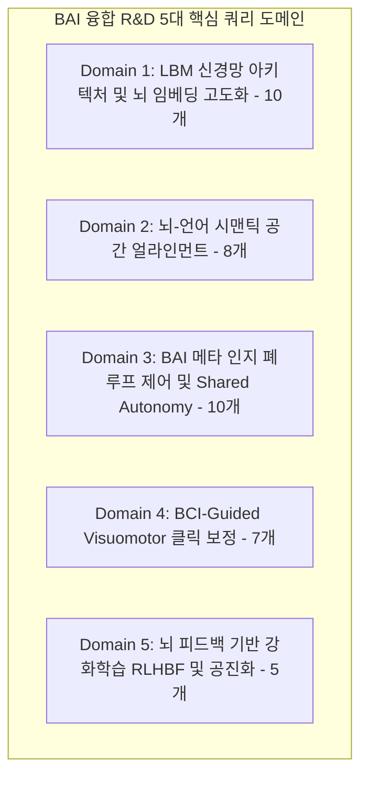

# 📋 LBM & Agent AI 융합 연구를 위한 40대 정밀 RAG 쿼리 계획서 (Notion Mirrored)

> 💡 **본 쿼리 계획의 목적**
> 구축 완료된 330여 개의 논문 지식베이스(`lbm-agent` 노트북) 및 실시간 Deep Research 엔진을 통해 **Brain-Agent Interface (BAI)**의 학술적·공학적 돌파구를 열기 위한 **40개의 초고밀도 탐색적 쿼리 세트**입니다.
> 
> * **연구 연계성**: 뇌과학 파운데이션 모델(DIVER, SwiFT, NRF)의 물리적 제약을 직시하면서, 에이전트 AI(OpenHands, OSWorld)의 인지 레이어 및 실행 레이어를 어떻게 유기적으로 결합할 것인지에 대한 구체적 해답을 수집하도록 설계되었습니다.

---

## 📂 쿼리 도메인 맵 (5대 핵심 연구 방향)

---

## 1️⃣ [Domain 1] LBM 신경망 아키텍처 및 뇌 임베딩 고도화 (10개)
DIVER, SwiFT, Neural Field Modeling(NRF)의 기하학적/수학적 특성과 물리적 시공간 한계(Latency Mismatch, SNR)를 극복하기 위한 심층 쿼리 세트입니다.

* **Q1.** `"DIVER channel equivariant EEG permutation spatio-temporal attention mathematical formulation"`
  - *목적*: DIVER의 채널 독립적 어텐션 가중치 보존 공식을 추출하여, 입력 노이즈 방어용 수학적 증명 설계.
* **Q2.** `"sliding temporal conditional positional encoding STCPE DIVER real-time eeg tracking"`
  - *목적*: STCPE가 EEG 신호의 실시간 변화를 추적하는 시간 해상도 한계 및 윈도우 스케일링 기법 수집.
* **Q3.** `"Swin 4D fMRI Transformer SwiFT computational complexity reduction MSA window"`
  - *목적*: SwiFT가 4D fMRI BOLD 볼륨을 선형적 복잡도로 다루는 shifted window 윈도우 분할 원리 파악.
* **Q4.** `"Implicit neural representation NRF coordinate Fourier encoding resolution agnostic brain"`
  - *목적*: MNI 표준 공간 상의 좌표(x,y,z)와 푸리에 인코딩을 활용하여 복셀 그리드를 탈피하는 암시적 함수(INR)의 수렴 최적화 기법 수집.
* **Q5.** `"fMRI BOLD hemodynamic response function HRF latency mismatch compensation methods"`
  - *목적*: 뇌 혈류의 물리적 지연(4~6초)을 보상하기 위한 칼만 필터(Kalman Filter) 또는 Deconvolution 모델링 기법 확보.
* **Q6.** `"scalp EEG non-invasive spatial blurring artifact rejection ICA deep learning"`
  - *목적*: 코딩 중의 눈 깜빡임, 미세 근육 움직임(EMG) 등 전극 노이즈를 실시간으로 제거하기 위한 딥러닝 아티팩트 제거 필터 탐색.
* **Q7.** `"cross-subject zero-shot generalization EEG pretraining dataset scale DIVER-1"`
  - *목적*: DIVER-1의 대규모 데이터셋(17.7k Subjects) 사전학습을 통한 교차 피험자 제로샷 BCI 일반화 성능 및 미세조정 기법 수집.
* **Q8.** `"iEEG invasive intracranial EEG cognitive control spatio-temporal decoding precision"`
  - *목적*: 비침습형 EEG의 한계를 보완하기 위해, 침습형 iEEG 기반의 고차원 인지 제어 디코딩 해상도 참조 데이터 확보.
* **Q9.** `"4D-fMRI dynamic functional connectivity graph neural networks brain state transition"`
  - *목적*: 시간 경과에 따른 fMRI 연결성 변화(Dynamic Functional Connectivity)를 에이전트의 작업 단계(Task State)와 매핑하는 그래프 인코딩 방식 탐색.
* **Q10.** `"LBM edge computing model pruning distillation latency reduction BCI BCI"`
  - *목적*: 1.82B DIVER-1의 실시간 10ms 이내 추론을 위한 모델 압축, 지식 증류(Knowledge Distillation) 기법 수집.

---

## 2️⃣ [Domain 2] 뇌-언어 시맨틱 공간 얼라인먼트 (8개)
뇌파의 시공간 임베딩을 LLM/VLM의 의미론적 토큰(Text Space)으로 정밀 정렬하는 기법을 탐색하는 쿼리 세트입니다.

* **Q11.** `"fMRI-LM neural decoding discrete token vector quantization language model"`
  - *목적*: VQ(Vector Quantization)를 통해 fMRI 임베딩을 이산 신경 토큰으로 변환하는 아키텍처 분석.
* **Q12.** `"NOBEL brain-language alignment neural tokenizer semantic space mapping"`
  - *목적*: 뇌파-언어 다차원 어텐션 매핑을 통해 언어와 뇌 반응 사이의 시맨틱 매핑 레이어 설계 기법 확보.
* **Q13.** `"cross-modal representation learning brain imaging text CLIP alignment"`
  - *목적*: CLIP 스타일의 대조 학습(Contrastive Learning)을 활용해 뇌 신호와 코드 텍스트(Source Code)의 직접 얼라인먼트 기법 수집.
* **Q14.** `"LLM input injection brain tokens [BRAIN_TOKEN] multimodal prompt engineering"`
  - *목적*: 멀티모달 LLM의 프롬프트 컨텍스트에 뇌파 토큰을 주입하는 인-컨텍스트 정렬 방식 파악.
* **Q15.** `"EEG neural machine translation continuous brain to text reconstruction"`
  - *목적*: 실시간 EEG 신호 흐름을 인지 대역폭 내에서 텍스트 시퀀스로 직접 재구성하는 최신 번역 디코더 모델 탐색.
* **Q16.** `"semantic representation of source code in human brain fMRI study"`
  - *목적*: 인간이 코드를 읽고 디버깅할 때 활성화되는 대뇌 피질의 언어/논리 네트워크 위치와 활성화 강도 분석.
* **Q17.** `"cognitive load estimation using text embeddings and EEG features fusion"`
  - *목적*: 텍스트 복잡도(임베딩 엔트로피)와 실시간 뇌파(EEG) 특징을 결합한 다차원 인지 부하 추정 모델 수집.
* **Q18.** `"multi-subject shared semantic space hyperalignment neural decoding"`
  - *목적*: 개별 피험자마다 다른 뇌 구조를 동일한 의미론적 잠재 공간으로 통합하는 하이퍼얼라인먼트(Hyperalignment) 기법 분석.

---

## 3️⃣ [Domain 3] BAI 메타 인지 폐루프 제어 및 Shared Autonomy (10개)
뇌 신호 피드백을 기반으로 에이전트의 자율 위임도를 동적으로 제어하고, 에러를 사전에 차단하기 위한 쿼리 세트입니다.

* **Q19.** `"Error-Related Potential ErrP EEG decoding real-time software engineering feedback"`
  - *목적*: 개발자의 뇌파에서 발생하는 ErrP 신호의 파형 특성(Ne/Pe) 및 실시간 90% 이상 디코딩 기법 파악.
* **Q20.** `"shared autonomy human-in-the-loop dynamic delegation level of autonomy"`
  - *목적*: 사용자의 인지 상태에 따라 AI 에이전트의 의사결정 권한(자율성 단계, LoA)을 조절하는 이론적 프레임워크 수집.
* **Q21.** `"OpenHands event stream user state observation event integration mechanism"`
  - *목적*: OpenHands 이벤트 스트림 아키텍처에 실시간 뇌 징후(Observation)를 유기적으로 추가하는 이벤트 핸들러 설계법 탐색.
* **Q22.** `"cognitive workload adaptive context summarization LLM prefill latency"`
  - *목적*: 인지 과부하 상황에서 LLM 컨텍스트 윈도우의 요약(Condensing) 강도를 동적으로 스케일링하는 적응형 알고리즘 수집.
* **Q23.** `"mental fatigue detection using scalp EEG dynamic sub-agent delegation"`
  - *목적*: fMRI/EEG 기반 장기 인지 피로도 분석을 바탕으로, 서브 에이전트에게 반복 연산 작업을 자동 위임하는 규칙 수집.
* **Q24.** `"frustration detection EEG machine learning tasks debugging errors"`
  - *목적*: 코딩 에러 및 테스트 실패 시 인간 개발자가 느끼는 순간적인 Frustration(좌절감) 디코딩 기법.
* **Q25.** `"any-variate attention EEG brain workload metric validation mental arithmetic"`
  - *목적*: DIVER의 any-variate 모델을 활용한 Mental Workload 산출 지표와 실제 태스크 난이도 간의 상관관계 유효성 검증 자료 수집.
* **Q26.** `"closed-loop BCI software environment rollback agent recovery"`
  - *목적*: 오류 인지 뇌파 수신 즉시 에이전트의 이전 안정 상태로 환경을 롤백(Rollback/Revert)시키는 동기식 인터랙션 설계.
* **Q27.** `"human cognitive control network frontoparietal fMRI SwiFT tracking"`
  - *목적*: SwiFT를 사용하여 전두엽-두정엽 인지 제어 네트워크(Frontoparietal Network)의 주의 집중 전환 흐름을 추적하는 방법 탐색.
* **Q28.** `"informal user query robust agent framework mutation testing"`
  - *목적*: 뇌파 인지 정보를 결합하여 모호하고 비정형적인 자연어 질의(mutated informal query) 발생 시 에이전트 성능의 견고성을 유지하는 원리.

---

## 4️⃣ [Domain 4] BCI-Guided Visuomotor 클릭 보정 (7개)
OSWorld 벤치마크 상의 에이전트 Grounding 실패(75% 오차)를 사용자의 시각적 주의 신호로 미세 보정하기 위한 쿼리 세트입니다.

* **Q29.** `"P300 visual attentional selection eye tracking EEG BCI GUI target"`
  - *목적*: 화면 상의 특정 UI 요소를 시각적으로 바라볼 때 발생하는 P300 신호 또는 정상상태 시각유발전위(SSVEP)의 공간 타겟팅 해상도 수집.
* **Q30.** `"fMRI Neural Field Modeling continuous spatial attention potential field GUI"`
  - *목적*: NRF의 MNI 공간 좌표 기반의 연속 신경 활성화 필드를 에이전트 샌드박스의 화면 픽셀 좌표(X, Y)로 기하학적으로 전사하는 방법.
* **Q31.** `"Accessibility Tree DOM structure integration visual grounding reinforcement"`
  - *목적*: OSWorld 화면의 DOM 노드 및 어시시빌리티 트리의 바운딩 박스 정보와 뇌의 주의 집중 확률 지도를 융합하는 그래프 결합 기법 탐색.
* **Q32.** `"probabilistic potential field mouse trajectory planning BCI robotics"`
  - *목적*: 로보틱스 상의 확률적 퍼텐셜 필드(Potential Field)를 차용해, 뇌 토큰 기반의 시각적 대상 중앙으로 마우스 궤적 및 클릭 지점을 보정하는 알고리즘 파악.
* **Q33.** `"OSWorld visual-verbal grounding failure click inaccuracy pixel level analysis"`
  - *목적*: 컴퓨터 에이전트가 화면 상의 타겟 메뉴를 미세하게 클릭 미스하는 저차원 행동(visuomotor) 실패의 패턴 정밀 분석.
* **Q34.** `"pop-up ads environmental noise UI changes agent robustness visual distractors"`
  - *목적*: 실세계 OS 환경에서 에이전트를 교란하는 예기치 못한 UI 노이즈(팝업, 리사이즈)를 인간의 시각 어텐션 신호로 무시(Filtering)하는 인지적 필터 기법.
* **Q35.** `"PPO reinforcement learning mouse trajectory optimization human guidance"`
  - *목적*: Proximal Policy Optimization(PPO) 기반 정책 망을 인간의 시선 및 뇌파 가이드를 통해 최적화하는 궤적 제어 모델 수집.

---

## 5️⃣ [Domain 5] 뇌 피드백 기반 강화학습 RLHBF 및 공진화 (5개)
인간의 실시간 신경 정보를 보상(Reward) 모델로 삼아 에이전트 AI를 종단간으로 강화학습 및 정렬시키는 미래지향적 쿼리 세트입니다.

* **Q36.** `"Reinforcement Learning from Human Brain Feedback RLHBF reward modeling"`
  - *목적*: 인간의 뇌파 피드백을 보상 신호로 모델링(RLHBF)하여 거대 언어 모델 및 에이전트 정책을 튜닝하는 아키텍처 및 연구 사례 수집.
* **Q37.** `"Error-Related Potential ErrP as penalty signal in reinforcement learning"`
  - *목적*: ErrP의 음성 편향 강도를 에이전트 강화학습 루프의 패널티 보상 함수로 정량적으로 변환하는 기법 수집.
* **Q38.** `"co-evolution human brain AI agent mutual adaptation alignment"`
  - *목적*: 장기적인 BAI 인터랙션 과정에서 인간의 두뇌 가소성(Brain Plasticity)과 AI 에이전트의 모델 가중치가 동시에 최적화되는 양방향 정렬 모델 탐색.
* **Q39.** `"multimodal trace dataset screenshot agent API EEG fMRI synchronized"`
  - *목적*: BAI 공동 R&D를 위한 [화면+에이전트 로그+뇌파] 멀티모달 동기화 데이터셋 설계 및 벤치마크 테스트베드 사양 수집.
* **Q40.** `"ethical guidelines neurotechnology brain privacy cognitive liberty BCI"`
  - *목적*: 뇌파 토큰이 외부 상용 에이전트(LLM)에 주입될 때 발생할 수 있는 뇌 프라이버시(Brain Privacy) 및 인지적 자유(Cognitive Liberty) 보호를 위한 보안 아키텍처 파악.
