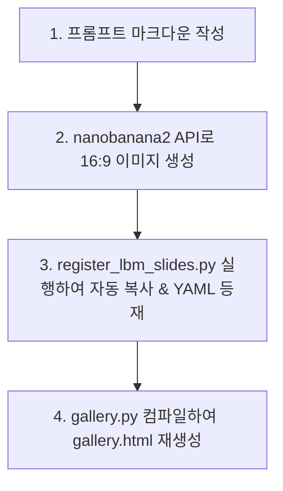

# 🔬 SNU Connectome Lab: BAI 융합 R&D 실습 및 온보딩 핸드아웃 (Notion Mirrored)

> 🎓 **Connectome Lab 연구원 및 대학원생 온보딩 가이드**
> 본 문서는 서울대학교 차지욱 교수 연구실의 뇌 파운데이션 모델(LBM) 연구와 차세대 Agent AI(OpenHands)의 융합 전략인 **Brain-Agent Interface (BAI)** R&D 프로젝트에 참여하는 학생들을 위한 실무 실습 및 온보딩 가이드라인입니다.
> 
> * **핵심 가치**: 로컬에 분산되어 준비된 Git 리포지토리 자산을 활용하여 직접 RAG 쿼리를 해보고, 발표 슬라이드 인포그래픽을 빌드해 카탈로그에 등록하고, Google Workspace CLI를 연동해 임시보관함에 메일을 올려보는 과정을 실습 중심으로 엮었습니다.

---

## 📂 1. 연구실 로컬 Git 리포지토리 구성 (Git Repositories)

프로젝트를 이어받아 개발하거나 추가하기 위해, 교수님 장비의 다음 두 리포지토리를 참조하고 본인의 샌드박스로 Clone 하여 R&D를 시작하세요.

* 📁 **1) 인포그래픽 카탈로그 & 갤러리 프로젝트 (현재 저장소)**: `Transconnectome/lbm-agent`
  * **설명**: LBM 발표자료와 카탈로그 데이터베이스, 16:9 슬라이드 갤러리를 컴파일하고 자동 등재하는 프레임워크 리포지토리입니다. (현재 열고 계신 저장소와 동일합니다.)
* 📁 **2) Gmail API & Emailer 커넥터 프로젝트**: `snuconnectome/Emailer` (또는 로컬 `/home/juke/git/Emailer`)
  * **설명**: 뇌파 피드백이나 에이전트의 관측 이벤트를 감지하여 이메일을 읽고 검색하며, 드래프트를 전송 및 생성하는 통합 백엔드 연동 리포지토리입니다.

---

## 💻 2. `nlm` RAG 지식베이스 실습 가이드 (RAG Query Practice)

우리 연구실이 수집한 **330여 개의 LBM & Agent AI 최신 학술 논문**이 들어있는 `lbm-agent` 지식베이스를 바탕으로 지식을 빠르게 검색하고 심화 학습을 진행해 봅시다.

### ⚙️ 기초 환경 검증 및 명령어 실행

```bash
# 1. 지식베이스 노트북 목록 및 lbm-agent 앨리어스 설정 상태 확인
nlm list

# 2. 대표적인 Spatiotemporal Attention 관련 DIVER-1 구조 RAG 쿼리 던지기
nlm query --notebook lbm-agent --mode deep "DIVER channel equivariant EEG foundation model spatio-temporal attention"

# 3. OSWorld 에이전트의 마우스 클릭 Grounding 실패 원인에 대한 쿼리
nlm query --notebook lbm-agent --mode deep "OSWorld agent visual grounding failure DOM accessibility tree"
```

### ➕ 신규 논문 소스 추가하기 (RAG 확장)
공동 세미나나 개별 연구 과정에서 중요한 최신 논문 PDF를 구했다면, 지식베이스에 즉시 주입해 다른 랩원들과 RAG 성능을 공유할 수 있습니다.

```bash
# 새로운 학술 논문 PDF를 lbm-agent 지식베이스에 추가
nlm source add --notebook lbm-agent --file /path/to/new_neuroscience_paper.pdf
```

---

## 🎨 3. 신규 인포그래픽 슬라이드 카탈로그 자동 등록 및 갤러리 빌드 실습

자신이 연구한 LBM이나 에이전트 융합 아이디어를 담은 16:9 슬라이드를 새로 제작하여 카탈로그 데이터베이스와 갤러리 HTML에 업데이트하는 파이프라인 실습입니다.

### 🪜 Step-by-Step 실습 과정



#### 1) 슬라이드 프롬프트 마크다운 설계 (`snu_neurox` 테마 적용)
프롬프트 마크다운을 설계할 때는 `prompt_constraints.py` 검증기를 통과하기 위해 아래 규칙을 엄격히 지켜야 합니다.
- **규칙 1**: 주석과 설명을 포함한 파일 전체 단어수가 **400단어**를 초과해서는 안 됩니다.
- **규칙 2**: 마크다운 파일 내의 HEX 색상 패턴(`#XXXXXX` 양식)이 **5개**를 초과해서는 안 됩니다. 핵심 4색(White/Gray 등은 영어 명칭으로 대체)으로 통일하세요.
- **규칙 3**: `circular`, `3d` 등 다이어그램 왜곡을 유발하는 노이즈 키워드를 `Negative` 영역에서 단순화하고 Flat 2D vector style로 통일합니다.

#### 2) 카탈로그 자동 복사 및 YAML 등록 스크립트 실행
이미지와 마크다운이 준비되면, 메타데이터 온톨로지 규칙(저장소 내 `docs/` 리소스 참조)에 맞춰 스크립트에 슬라이드 데이터 딕셔너리를 추가한 후 실행합니다.

```bash
# 1. 리포지토리 루트 디렉토리로 이동 후 패키징된 스크립트 실행
python docs/scripts/register_lbm_slides.py
```

#### 3) 단일 정적 갤러리 HTML 재생성
등록된 YAML 카탈로그와 복사된 아웃풋 이미지를 병렬 수집하여 base64로 썸네일을 인라인 인코딩하고, 갤러리 포트폴리오 웹사이트 `gallery.html`을 루트에 재생성합니다.

```bash
# 갤러리 컴파일 실행 명령어 (로컬 갤러리 빌더 환경이 구비된 경우 실행)
python docs/scripts/gallery.py --output gallery.html
```

---

## 📧 4. `gws` CLI를 활용한 Gmail API 드래프트 생성 실습

BAI 폐루프 R&D나 외부 에이전트 트리거 반응으로 Gmail 임시보관함에 메일 초안을 자동으로 올리거나 모니터링하는 실습입니다.

### ⚙️ Google Workspace CLI (`gws`) 기초 연동 확인

```bash
# 1. gws CLI가 교수님 계정으로 제대로 인증되었는지 확인
/home/juke/.npm-global/bin/gws gmail users messages list --params '{"userId": "me"}'

# 2. drafts create 스키마 명세 조회해보기
/home/juke/.npm-global/bin/gws schema gmail.users.drafts.create
```

### ⚡ 파이썬 스크립트를 통한 드래프트 자동 생성 실습
아래 명령어를 입력해, 우리가 미리 구성해둔 자동 드래프트 빌더 파이썬 스크립트를 실행하여 본인의 임시보관함 연동 상태를 확인하고 이메일 원문 RFC 822 변환 과정을 실습해 봅니다.

```bash
# 패키징된 Gmail 임시보관함 드래프트 자동 등록 실행
python docs/scripts/create_gmail_drafts.py
```

---

## 🚩 5. 대학원생/연구원 공동 연구 피드백 액션 항목 (Action Items)

학생들은 이 가이드와 핸드아웃을 학습한 후 아래 3가지 액션을 수행하여 교수님께 피드백을 전달해야 합니다.

- [ ] **1. 보고서 피드백**: [strategic_lbm_agent_ai_report.md](strategic_lbm_agent_ai_report.md)의 3대 물리적 장벽 및 5개년 로드맵 단계 구상에 대한 세부 의견 추가하기.
- [ ] **2. 갤러리 검증**: [gallery.html](../gallery.html)를 브라우저로 직접 열어 새로 등재된 LBM 슬라이드 6장의 디자인 완성도 및 가독성 검토하기.
- [ ] **3. RAG 쿼리 확장**: `lbm_agent_rag_query_plan.md` 계획서의 40대 쿼리 중 본인의 개별 학위 논문 연구와 가장 부합하는 쿼리를 RAG 노트북(`lbm-agent`)에 던져본 후, 그 쿼리 결과 분석 마크다운에 추가 기재하여 교수님께 메일 회신하기.
