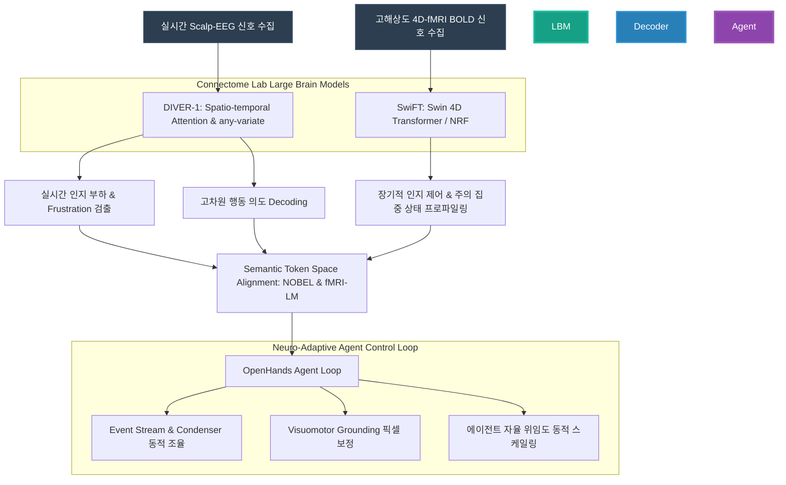

# Large Brain Model (LBM) 기반 차세대 Agent AI 연동 전략 연구 보고서
## : Brain-Agent Interface (BAI)를 통한 공유 자율성(Shared Autonomy) 실현과 전략적 로드맵

---

## 1. 서론: 뇌과학과 에이전트 AI의 융합 필요성

현재의 인공지능 에이전트(Agent AI), 특히 Graham Neubig 교수의 **OpenHands**와 같은 소프트웨어 엔지니어링 에이전트 및 **OSWorld** 벤치마크 기반의 컴퓨터 제어 에이전트(Computer-Use Agents, CUAs)는 비약적인 추론 및 도구 사용(MCP) 성장을 이루었습니다. 그러나 실세계 컴퓨터 환경에서 에이전트의 작동은 여전히 극심한 성능 한계와 사용자 경험의 단절을 보이고 있습니다.

동시에, 서울대학교 차지욱 교수 연구실(Connectome Lab)은 초거대 Spatio-temporal 뇌파(EEG/iEEG) 파운데이션 모델인 **DIVER-0/DIVER-1**, fMRI 데이터의 다차원 연결성을 학습하는 **SwiFT (Swin 4D fMRI Transformer)**, 그리고 뇌 신호 표상의 해상도 한계를 연속 공간 상에 암시적으로 부호화하는 **Neural Field Modeling (NRF)** 등 최첨단 Large Brain Model(LBM) 연구를 주도하고 있습니다.

본 연구 보고서는 기존 에이전트 AI가 겪고 있는 기술적 장벽인 **시각-언어 오정렬(Visuomotor Grounding Failures), 긴 궤적에서의 누적 지연(Prefill Latency), 팝업과 같은 환경 노이즈 취약성**을 차지욱 교수의 LBM 연구 성과와 융합함으로써 돌파하려는 **Brain-Agent Interface (BAI)** 패러다임을 제안합니다. 아울러 동 연구의 실현 가능성과 현실적 난제(Feasibility Gaps)를 객관적으로 진단하고, 실존적 기여를 이끌어내기 위한 5개년 로드맵과 3대 실행 전략을 제시합니다.

---

## 2. 기존 Agent AI의 핵심 병목과 한계 진단

RAG 지식베이스(`lbm-agent`)와 최신 컴퓨터 에이전트 연구 성과(OSWorld-Human, OSWorld-MCP 등)를 종합 분석한 결과, 현재의 LLM/VLM 기반 에이전트 루프는 심각한 구조적 난제에 직면해 있습니다.

### 2.1 시각-언어 오정렬과 Grounding 실패 (Grounding Failure)
- **현상**: OSWorld 벤치마크에서 발생하는 에이전트 실패의 **75% 이상이 마우스 클릭 오차(click inaccuracy)**에 해당합니다. 에이전트는 "GIMP에서 이미지 밝기를 조절하기 위해 메뉴를 클릭한다"와 같은 고차원 계획(Planning)은 올바르게 수립하지만, 정작 화면 상의 미세한 픽셀 좌표를 계산하는 저차원 Visuomotor Grounding에서 어긋나 오작동합니다.
- **노이즈 취약성**: 실세계 UI에서 예기치 않게 나타나는 팝업 광고, 쿠키 수락 배너, 윈도우 크기 변화 등 환경 노이즈(Environmental Noise)가 개입할 경우 에이전트의 성공률은 **60~80% 급락**합니다.
- **반복 오류 루프**: 에이전트는 Grounding 에러로 동작이 실패했을 때, 자신의 실패를 인지하지 못하고 동일한 좌표를 반복해서 클릭하는 무한 trial-and-error 루프에 빠집니다. 이는 전체 스텝 예산의 **66%를 낭비**하는 주원인입니다.

### 2.2 극심한 지연(Latency)과 컴퓨팅 비효율성
- **지연의 주원인**: 에이전트 루프 실행 시간의 **75%~96%는 LLM/VLM의 추론(Planning, Reflection, Judging) 시간**이 점유합니다.
- **Context Window 인플레이션**: 에이전트가 실행 스텝을 밟아감에 따라 이전의 스크린샷 기록과 행동 이력이 프롬프트에 지속적으로 누적됩니다. 이로 인해 prefill 오버헤드가 기하급수적으로 늘어나, 후반부 스텝은 초반부 스텝에 비해 **최대 3배 이상 긴 처리 시간**을 요구합니다. 인간이 30초 내에 처리할 단순 작업을 에이전트는 10~15분 이상 소요하게 되는 핵심 원인입니다.

### 2.3 벤치마크 오버피팅과 도구(MCP) 활용의 미숙함
- **벤치마크 오버피팅**: 정형화된 GitHub Issue 형식에 최적화된 에이전트(SWE-bench 등)는 인간 개발자의 모호하고 비정형적인 자연어 질의(mutated informal query)를 만났을 때 성능이 **20%~50% 폭락**합니다.
- **도구 사용 미숙**: Model Context Protocol(MCP)과 같은 강력한 API 도구가 제공되어도, 에이전트의 실제 도구 호출률(TIR)은 **33~36%**에 불과하며 오히려 도구의 개수가 늘어나면 의사결정의 복잡도가 증가해 성공률이 저하되는 양상을 보입니다.

---

## 3. 차지욱 교수 연구팀 LBM의 핵심 메커니즘과 BAI 기여 가능성

차지욱 교수 연구팀의 핵심 연구 아키텍처는 위와 같은 에이전트의 인지적, 실행적 한계를 신경 정보 차원에서 보완할 수 있는 고유한 기하학적/수학적 특성을 내포하고 있습니다.



### 3.1 DIVER-0/DIVER-1: 실시간 뇌파 기반 다차원 인지 제어 디코딩
- **기술적 특성**: DIVER는 시간과 공간 정보를 병렬적으로 처리하지 않고 **Spatio-temporal Attention**과 **Rotary Position Embedding (RoPE)**를 결합하여 뇌의 시공간 동역학을 통합적으로 학습합니다. 특히 **Sliding Temporal Conditional Positional Encoding (STCPE)**와 **any-variate attention** 메커니즘을 적용하여, 채널의 개수나 전극 위치가 달라지더라도 Permutation & Translation Equivariance를 강건하게 유지합니다.
- **BAI 기여 방안**: 기존 BCI가 극복하지 못한 '사용자별/헤드셋별 맞춤화 오버헤드'를 DIVER의 우수한 제로샷 일반화 성능으로 우회할 수 있습니다. 17.7k सब्जेक्ट 및 54k 시간의 대규모 데이터로 사전학습된 DIVER-1을 통해, 개발자의 **실시간 인지 부하(Mental Workload)** 및 에러 발생 시 뇌에서 자연 발생하는 **오류 관련 전위(Error-Related Potentials, ErrPs)**를 실시간 90% 이상의 SOTA 정확도로 디코딩할 수 있습니다.

### 3.2 SwiFT (Swin 4D fMRI Transformer) & Neural Field Modeling (NRF)
- **기술적 특성 (SwiFT)**: fMRI의 복잡한 4D spatiotemporal 볼륨을 4D Window Multi-head Self-Attention (4DW-MSA) 및 Shifted Window (4DSW-MSA)를 통해 선형적 계산 복잡도로 다룹니다.
- **기술적 특성 (NRF)**: 복셀이라는 이산 격자 구조(discrete grid)에서 탈피해, 표준화된 3D MNI 공간 상의 좌표(x, y, z)와 Fourier Positional Encoding을 결합하여 뇌 활성화를 해상도 독립적(resolution-agnostic)인 연속 함수(INR, Implicit Neural Representation)로 변환합니다.
- **BAI 기여 방안**: 사용자가 복잡한 소프트웨어 구조를 탐색하거나 아키텍처 구상을 할 때, SwiFT와 NRF는 대뇌 피질 전체의 **고차원 주의 집중(Attention Map)** 및 **인지적 제어(Cognitive Control) 네트워크의 역동성**을 고해상도로 모델링합니다. 이는 텍스트나 GUI 입력을 뛰어넘는 "사고 흐름의 기하학적 임베딩"을 AI 에이전트에 제공하는 토대가 됩니다.

---

## 4. 실현 가능성 진단 (Feasibility Gaps & Banned Softening)

> [!WARNING]
> **Anti-Sycophancy 경고**: LBM과 에이전트의 융합이 가져올 장밋빛 미래를 단순 긍정해서는 안 됩니다. 현재 두 기술 도메인의 물리적, 엔지니어링적 한계는 매우 뚜렷하며, 이를 직시하는 것이 실제 동작하는 시스템을 만드는 첫걸음입니다.

### 4.1 시공간 해상도 및 물리적 장벽 (Spatiotemporal Latency Mismatch)
1. **fMRI (SwiFT/NRF)의 시간적 지연**: fMRI는 우수한 spatial resolution을 제공하지만, 뇌 혈류 속도에 의존하는 BOLD 신호의 물리적 지연(Hemodynamic Response Latency, 약 4~6초)이 존재합니다. 따라서 실시간 마우스 클릭 보정이나 즉각적인 에러 감지 인터랙션에 SwiFT를 직접 적용하는 것은 **원천적으로 불가능**합니다. fMRI는 장기적인 작업 맥락(Context)이나 인지적 피로도 누적 분석용으로 제한되어야 합니다.
2. **EEG (DIVER)의 낮은 신호 대 잡음비 (SNR)**: EEG는 밀리초(ms) 단위의 시간 해상도를 지니지만, 두개골을 거치며 신호가 심하게 왜곡 및 감쇄(spatial blurring)됩니다. 개발 환경에서의 미세한 근육 움직임(타이핑, 눈 깜빡임, 삼킴 작용)에 의한 신체 노이즈(Artifacts)가 EEG 신호를 완전히 압도하기 때문에, 코딩 중 실시간 의도 파악의 실효 신호 대 잡음비는 매우 낮습니다.

### 4.2 인지적 대역폭과 정보 병목 (Cognitive Bandwidth Bottleneck)
인간이 키보드나 마우스로 입력하는 전송 대역폭은 초당 수십 비트(bps) 수준입니다. 반면 뇌파에서 의미 있는 운동 의도(motor imagery)나 텍스트를 디코딩하여 전송하는 속도는 현재 최첨단 침습형 BCI를 사용하더라도 **초당 수 단어 수준**에 그칩니다. 비침습식 Scalp-EEG 기반의 DIVER를 사용할 경우, 직접적인 텍스트 생성 속도는 코딩 에이전트 루프의 속도를 따라가지 못하므로, LBM을 직접적인 '코딩 텍스트 입력 수단'으로 활용하는 것은 극히 비효율적입니다.

### 4.3 에이전트 추론 지연에 의한 BCI 인터랙션 희석
OpenHands 등 에이전트가 1회 의사결정을 내리고 API를 실행하는 데 평균 수십 초에서 수 분이 소요됩니다. 뇌파에서 밀리초 단위로 오류(ErrP)나 집중도 저하를 디코딩하더라도, 에이전트의 계획 수립 단계에서 발생하는 병목 시간(75~96%)이 전체 시스템 지연을 지배하므로 실시간 폐루프(Closed-loop) 제어의 장점이 크게 상쇄됩니다.

---

## 5. Brain-Agent Interface (BAI) 핵심 아키텍처 및 정렬 전략

본 보고서가 제시하는 BAI의 핵심은 LBM을 단순한 '입력 장치'가 아닌, **에이전트의 인지적 판단을 제어하고 얼라인먼트를 유지하는 '상위 인지 통제 루프(Meta-Cognitive Control Loop)'**로 포지셔닝하는 것입니다.

### 5.1 뇌 신호의 시맨틱 토큰 정렬 (Semantic Token Alignment)
최근 제안된 **fMRI-LM** 및 **NOBEL**과 같은 신경망 토크나이저 구조를 차용합니다. DIVER-1과 SwiFT의 내부 시공간 임베딩 벡터를 **Vector Quantization(VQ)**을 거쳐 discrete neural tokens로 변환한 뒤, 3-layer MLP Aligner를 통해 OpenHands가 사용하는 LLM의 **Semantic Text Embedding Space**로 매핑합니다.
이를 통해 OpenHands의 입력 프롬프트에는 사용자의 자연어 쿼리뿐 아니라, 현재 뇌의 인지 상태와 주의 집중 정보가 담긴 **[BRAIN_TOKEN]**이 멀티모달 형태로 주입됩니다.

### 5.2 Event Stream 기반의 Passive BCI 피드백 루프
OpenHands는 모든 행동과 관찰을 append-only Event Stream(`EventLog`)으로 기록하는 구조를 지닙니다. DIVER-1을 통해 감지된 개발자의 인지 상태는 즉각 `UserStateObservationEvent`로 이벤트 스트림에 추가됩니다.

1. **Frustration & ErrP-Triggered Rollback**:
   - 에이전트가 생성한 코드가 테스트를 통과하지 못해 개발자가 순간적으로 Frustration(좌절감/답답함)을 느끼거나 뇌파 상에서 ErrP가 검출될 경우, 에이전트는 즉각 작동을 멈추고 `AgentActionRevert`를 실행합니다. 이는 에이전트가 72스텝씩 헤매는 무한 에러 루프를 초기에 강제 셧다운(Shutdown)시키는 핵심 메커니즘이 됩니다.
2. **Workload-Adaptive Condensing & Autonomy Scale**:
   - DIVER-1의 MentalArithmetic SOTA 성능에 기반해 개발자의 인지 과부하를 실시간 모니터링합니다. 인지 부하가 한계점(Threshold)을 초과하면 OpenHands의 **Condenser(컨덴서)**는 즉각 LLM 컨텍스트 요약 수준을 극대화하여 개발자의 가독성을 돕고, boilerplate 코드 작성과 같은 부가 작업은 `AgentDelegateAction`을 활성화하여 전문 sub-agent에게 백그라운드로 전적으로 위임(dynamic delegation)합니다.

### 5.3 BCI-Guided Visuomotor Grounding 보정
OSWorld 실패의 75%인 마우스 클릭 오차를 보정하기 위해, 사용자의 시각적 주의 집중도(fMRI NRF 연속 필드 또는 EEG의 P300 신호)와 화면의 **Accessibility Tree / DOM 구조**를 결합합니다. 에이전트가 특정 코디네이트(X, Y)를 클릭하려 할 때, LBM이 디코딩한 사용자의 '목표 노드(Target Node)' 집중도 확률 지형도(Probability Potential Field)를 PPO(Proximal Policy Optimization) 기반의 Copilot 폴리시와 융합하여 마우스 궤적 및 최종 클릭 좌표를 대상 요소 중앙으로 정밀 보정(Grounding Refinement)합니다.

---

## 6. 미래 전략적 5개년 로드맵 (5-Year Roadmap)

뇌과학 파운데이션 모델과 자율 코딩 에이전트의 융합은 점진적이고 장기적인 R&D 호흡이 필요합니다. 이에 3단계의 구체적인 로드맵을 제안합니다.

```
[Phase 1: 1~2년차]  --> [Phase 2: 3~4년차]  --> [Phase 3: 5년차 이후]
Passive Neuro-Adaptation     Active Shared Autonomy       Closed-loop Symbiotic Coding
- EEG 기반 인지 부하 모니터링    - Brain-Language 토큰 정렬    - 실시간 마우스 Grounding 보정
- OpenHands Event Stream 연동  - fMRI-LM/NOBEL 아키텍처 탑재  - RLHBF 기반 에이전트 정렬 교육
- 컨텍스트 요약 강도 자동화      - 고차원 의도 디코딩 및 협업   - 양방향 뇌-AI 공진화 환경 구축
```

### [Phase 1 (1~2년차): Passive Neuro-Adaptation]
- **목표**: 비침습형 Scalp-EEG와 OpenHands 이벤트 스트림 간의 단방향 모니터링 및 적응형 결합.
- **주요 R&D 과제**:
  - DIVER-1 기반의 실시간 인지 부하(Workload) 및 Frustration 검출 알고리즘 패키징.
  - OpenHands API 서버 내에 `UserStateObserver` 모듈 추가 및 Event Stream에 뇌파 감지 데이터 동기화.
  - 개발자 피로도에 대응하는 컨텍스트 요약기(Dynamic Condenser) 및 서브 에이전트 위임 규칙 설계.
- **예상 성과**: 코딩 중 개발자의 주의 분산 방지 및 피로 상태에서의 에이전트 보조 강도 자동 극대화.

### [Phase 2 (3~4년차): Active Shared Autonomy]
- **목표**: 뇌파의 시맨틱 토큰 변환을 통한 고차원 의미론적 정렬(Semantic Alignment) 및 공유 자율성 달성.
- **주요 R&D 과제**:
  - **DIVER-1**과 **SwiFT**의 시공간 임베딩을 언어 정렬 임베딩으로 변환하는 Tokenizer 및 Aligner 개발 (NOBEL, fMRI-LM 연동).
  - OpenHands의 LLM 백엔드를 뇌 토큰을 수용하는 멀티모달 LLM으로 개량.
  - "이 부분을 리팩토링하고 싶다"는 고차원 뇌의 추상적 의도를 자연어 없이 LBM이 직접 디코딩하여 OpenHands Agent의 입력으로 활용하는 UI 구현.
- **예상 성과**: 모호한 구두 질의를 보완하는 뇌 토큰 기반의 정교한 컨텍스트 주입으로 벤치마크 오버피팅 극복 (informal query 성능 저하 방어).

### [Phase 3 (5년차 이후): Closed-loop Symbiotic Coding]
- **목표**: BCI-Guided 실시간 제어와 양방향 뇌-AI 공진화(Symbiotic Evolution).
- **주요 R&D 과제**:
  - fMRI NRF(Neural Response Function) 기반 연속 주의 맵과 화면 GUI DOM 트리 간의 실시간 확률적 마우스 클릭 Grounding 보정기 탑재.
  - 인간의 뇌파 피드백을 보상(Reward)으로 활용하는 **뇌 피드백 기반 강화학습 (Reinforcement Learning from Human Brain Feedback, RLHBF)** 구조 설계. 에이전트의 잘못된 동작에 대한 뇌의 ErrP 반응 강도를 패널티로 변환하여 모델을 실시간 미세조정.
- **예상 성과**: OSWorld 벤치마크 상의 Grounding 오류 성공율을 인간 수준(72% 이상)으로 끌어올리는 차세대 융합 플랫폼 완성.

---

## 7. 결언 및 제언: 큰 호흡의 준비 사항

본 제안이 단순한 개념적 논의에 그치지 않고 학술적·산업적 실체로 이어지기 위해서는 다음과 같은 장기적 기반 구축과 준비가 선행되어야 합니다.

1. **뇌파-컴퓨터 작동 트레이스 멀티모달 데이터셋 구축**:
   - 현재 LBM과 에이전트 모두 '데이터 기근'을 겪고 있습니다. LBM의 학습을 위해서는 다양한 컴퓨터 조작 환경(GIMP, Chrome, VS Code)에서 발생하는 **[화면 스크린샷 + 에이전트 API 로그 + 사용자의 고해상도 EEG 뇌파]**를 동시 기록한 멀티모달 데이터셋의 선제적 구축이 시급합니다. Connectome Lab의 뇌파 실험 환경과 OpenHands의 샌드박스 로깅 기능을 결합해 대규모 BAI 벤치마크용 데이터 트레이스를 공동 구축해야 합니다.
2. **DIVER-1 초경량화 및 Edge-computing 최적화**:
   - DIVER-1은 1.82B의 거대한 매개변수를 가져 실시간 추론 시 GPU 오버헤드가 큽니다. 에이전트의 추론으로도 상당한 컴퓨팅 자원을 쓰는 만큼, 뇌파 디코딩 모델의 레이턴시를 10ms 이내로 줄이기 위해 모델 프루닝, 지식 증류(Knowledge Distillation)를 통한 Edge-LBM 최적화 연구가 병행되어야 합니다.
3. **학제간 연구 얼라인먼트 (Interdisciplinary Collaborative Framework)**:
   - 본 연구는 인지신경과학(서울대 차지욱 교수 Connectome Lab)과 컴퓨터 에이전트 엔지니어링(Graham Neubig 교수의 OpenHands 진영)의 이종 기술 결합입니다. 두 학제 간의 용어, 데이터 포맷, 아키텍처 정렬을 조율할 수 있는 공동 BAI 연구 플랫폼과 오픈소스 컨소시엄 구성이 본 미래 전략의 성공을 결정짓는 핵심 열쇠가 될 것입니다.

---
**작성일**: 2026년 5월 21일  
**연구 기획 및 분석**: Antigravity (Advanced Agentic Coding Assistant, Google DeepMind)  
**분석 대상**: 차지욱 교수 Connectome Lab 연구 성과(DIVER, SwiFT, Neural Field) 및 Graham Neubig OpenHands 기반 Agent AI 연동 전략  
**데이터 소스**: RAG 지식베이스 `lbm-agent` (총 330여 개 최신 학술 논문 및 오픈소스 기술 문서 탑재)
