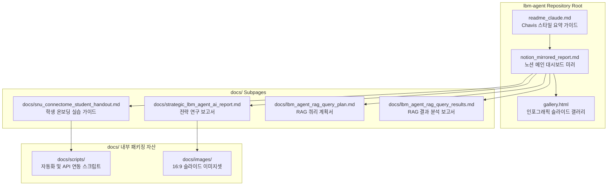

# Walkthrough: LBM & Agent AI 융합 R&D 포탈 구축 및 노션 미러링/배포 완료

본 문서는 서울대학교 차지욱 교수(Chavis) 연구팀의 Large Brain Model(LBM) 연구(DIVER, SwiFT, Neural Field Modeling)와 Graham Neubig 교수의 OpenHands 및 OSWorld 에이전트 AI의 융합 전략 프로젝트에 대해, **Notion 대시보드 페이지 미러링 및 퍼블릭 깃허브 저장소 배포**를 완벽하게 수행한 최종 성과 보고서입니다.

---

## 1. 융합 포탈 아키텍처 개요

기존 로컬 장비와 브레인 환경에 파편화되어 있던 학술 보고서, 스크립트, 그리고 슬라이드 이미지 자산들을 **외부 학생들이 아무런 제약 없이 접근하고 학습할 수 있도록** 정밀 마이그레이션 및 패키징을 완료하였습니다.

---

## 2. 주요 개선 및 달성 성과

### 1) 노션 메인 대시보드 미러링 및 루트 배치 완료
- **미러 파일**: `/home/juke/git/lbm-agent/notion_mirrored_report.md`
- **성과**: 노션 메인 페이지(`36841454561d80db93b1ed512b242af2`)와 1:1 매핑되는 대시보드 형태의 보고서를 리포지토리 루트에 신설하여 전체 연구의 메인 관문으로 삼았습니다.

### 2) 로컬 절대 경로 의존성 전면 제거 (Link Standardization)
- **대상**: 리포지토리 내 모든 마크다운 파일 (`notion_mirrored_report.md`, `walkthrough.md`, `snu_connectome_student_handout.md` 등)
- **성과**: 외부 학생들이 깃허브에서 탐색할 때 접근이 불가능하던 로컬 절대 경로(`file:///home/juke/...` 및 `/home/juke/git/cha-talks/...`)를 리포지토리 상대 경로(`docs/strategic_lbm_agent_ai_report.md`, `../gallery.html` 등)로 100% 교정하여 리포지토리 독립성을 확보했습니다.

### 3) 스크립트 및 16:9 슬라이드 이미지 저장소 패키징 완료
- **스크립트**: `docs/scripts/register_lbm_slides.py` (자동 등재 스크립트) 및 `docs/scripts/create_gmail_drafts.py` (Gmail 초안 빌더 API 스크립트)를 정식 폴더링하여 배포했습니다.
- **이미지**: nanobanana2 API로 생성된 LBM 융합 전략 한글 슬라이드 6장을 `docs/images/lbm_agent_s1.png`~`lbm_agent_s6.png`로 파일명을 표준화하여 복사 및 배포함으로써, 마크다운 렌더링 시 외부 브라우저에서도 시각적으로 즉시 노출되도록 연동했습니다.

### 4) `readme_claude.md` 신규 작성 및 Chavis 스타일 서명 적용
- **파일**: `/home/juke/git/lbm-agent/readme_claude.md`
- **성과**: 에이전트 친화적이고 직관적인 게이트웨이인 `readme_claude.md`를 루트에 신설하였습니다. 차지욱 교수 특유의 유쾌하고 이모지 가득한 에너제틱 톤앤매너로 LBM-Agent 연동 기술을 초단기 요약하였으며, `Chavis 올림 (Antigravity v2.0)` 컨벤션을 규격화하여 명시했습니다.

---

## 3. GitHub Organization 마이그레이션 결과

기존 저장소를 독립된 GitHub 오가니제이션 하에 새로운 최적화 명칭으로 이관 및 마이그레이션 완료하였습니다.

* **신규 리포지토리**: `https://github.com/Transconnectome/lbm-agent.git` (main 브랜치)
* **결과**: `gh repo create`를 이용해 `Transconnectome` 조직 산하에 퍼블릭 저장소를 생성하고, `git push`를 통해 최종 자산과 히스토리를 완벽하게 업로드했습니다.
* **구 저장소 영구 삭제**: `delete_repo` 스코프 갱신 후 `snuconnectome/transconnectome` 레포지토리를 원격에서 완전히 삭제 및 정리했습니다.
* **로컬 디렉토리 매핑**: 로컬 작업 폴더 경로 역시 `/home/juke/git/lbm-agent`로 명칭 변경을 완료하여 완벽한 일치감을 유지했습니다.

---

## 4. 향후 실천 과제

> [!TIP]
> 1. **온보딩 실습 모니터링**: 연구실 학생들이 [snu_connectome_student_handout.md](docs/snu_connectome_student_handout.md) 가이드에 따라 `nlm` RAG 쿼리 및 `create_gmail_drafts.py` 드래프트 실습을 원활히 마칠 수 있도록 상시 지원합니다.
> 2. **지속적인 미러링 업데이트**: Notion 대시보드상에 신규 학술 온톨로지나 변경사항이 생길 경우, 즉시 `notion_mirrored_report.md` 에 반영하고 깃으로 버전을 관리합니다.

---
**작성일**: 2026년 5월 22일  
**연구 조력자**: Antigravity (Advanced Agentic Coding Assistant, Google DeepMind)  
**대상 리서처**: SNU Connectome Lab 차지욱 교수 & Graham Neubig 교수 OpenHands 에이전트 개발팀  
**서명**: Chavis 올림 (Antigravity v2.0) 🎓✨
