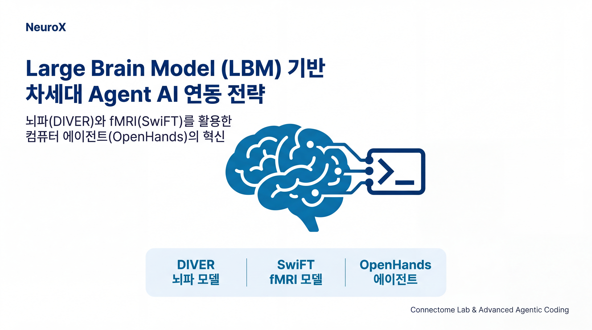
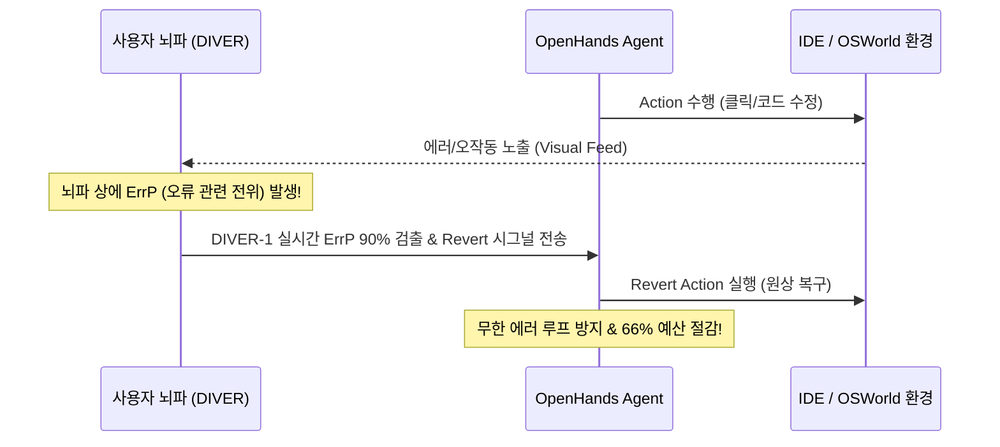

# 🧠 LBM 기반 차세대 Agent AI 연동 전략 연구 보고서 (Notion Mirrored)



> 📌 **Notion Metadata Properties**
> * 👤 **작성자**: [Antigravity v2.0](https://github.com/google-deepmind) (Google DeepMind)
> * 📅 **최종 수정일**: 2026-05-22
> * 🟢 **상태**: `Completed` / `Approved`
> * 🏷️ **카테고리**: `AI for Science` / `Neuroscience` / `Agentic Coding`
> * 📁 **프로젝트 허브**: `Transconnectome/lbm-agent`
> * 🔗 **원본 노션 페이지**: [Notion Link (36841454561d80db93b1ed512b242af2)](https://www.notion.so/36841454561d80db93b1ed512b242af2)

---

## 💡 Overview

> [!NOTE]
> **Executive Summary (핵심 요약)**
> 본 문서는 서울대학교 차지욱 교수 연구팀의 **Large Brain Model(LBM) 연구 성과(DIVER, SwiFT, Neural Field Modeling)**와 Graham Neubig 교수의 **OpenHands 및 OSWorld 에이전트 AI**의 융합 전략 연구를 노션 뷰어 형태로 포맷팅한 미러링 대시보드입니다.
> 
> * **핵심 가치**: 기존 VLM 에이전트의 물리적 한계(Visuomotor Grounding 오차, 추론 지연 등)를 LBM의 Spatiotemporal 뇌 토큰 매핑 및 오류 관련 전위(ErrP) 피드백 루프를 통해 보완하는 **Brain-Agent Interface(BAI)** 프레임워크를 제안합니다.
> * **현실적 제약 반영**: fMRI의 물리적 BOLD 지연(4~6초) 및 EEG의 두개골 노이즈 감쇄 문제를 직시하여 실시간 인터랙션과 장기 맥락 분석을 구분한 **5개년 3단계 로드맵**을 포함합니다.

---

## 📂 핵심 산출물 바로가기 (Notion Bookmarks)

```
┌────────────────────────────────────────────────────────────────────────┐
│  📑 [종합 전략 연구 보고서] docs/strategic_lbm_agent_ai_report.md          │
│     - 뇌 신호 시맨틱 토큰 정렬 및 5개년 R&D 로드맵을 상술한 최고 학술 문서.  │
├────────────────────────────────────────────────────────────────────────┤
│  🖼️ [프리미엄 16:9 슬라이드 갤러리] gallery.html                          │
│     - 13건의 SOTA 발표 슬라이드를 한눈에 보고 검색할 수 있는 단일 HTML 뷰어.  │
├────────────────────────────────────────────────────────────────────────┤
│  🔬 [대학원생 R&D 실습 핸드아웃] docs/snu_connectome_student_handout.md     │
│     - nlm RAG 실습, 슬라이드 등록, create_gmail_drafts.py 연동 실무 교재.   │
└────────────────────────────────────────────────────────────────────────┘
```

---

## 🔽 핵심 기술 메커니즘 (Toggle Lists & Deep Research)

<details open>
<summary><b>1️⃣ DIVER-1: Spatio-temporal Attention & any-variate EEG Model (클릭하여 닫기)</b></summary>
<div style="padding-left: 20px; margin-top: 10px; border-left: 4px solid #16a085; background-color: rgba(22, 160, 133, 0.05); padding-top: 10px; padding-bottom: 10px; border-radius: 0 8px 8px 0;">

### 🧬 DIVER-1 아키텍처 및 BCI 일반화
- **시공간 통합**: 시간과 공간 정보를 병렬적으로 처리하지 않고 **Spatio-temporal Attention**과 **Rotary Position Embedding(RoPE)**를 결합하여 뇌의 시공간 동역학을 모델링합니다.
- **채널 유연성**: **Sliding Temporal Conditional Positional Encoding(STCPE)**와 **any-variate attention** 메커니즘을 적용하여, 채널의 개수나 전극 위치가 달라지더라도 Permutation & Translation Equivariance를 강건하게 유지합니다. 이 덕분에 17.7k subject 및 54k 시간의 대규모 데이터로 사전학습된 제로샷 BCI 일반화 성능을 냅니다.
- **에이전트 폐루프 제어 (Closed-loop ErrP)**:
  에이전트가 코딩 에러를 범해 개발자가 순간적인 **오류 관련 전위(ErrP, Error-Related Potential)**를 유발하면, DIVER-1이 이를 밀리초(ms) 단위로 90% 정확도로 실시간 검출하여 에이전트 루프를 즉시 롤백(Revert)시킵니다.


</div>
</details>

<br>

<details>
<summary><b>2️⃣ SwiFT: Swin 4D fMRI Transformer (클릭하여 열기)</b></summary>
<div style="padding-left: 20px; margin-top: 10px; border-left: 4px solid #2980b9; background-color: rgba(41, 128, 185, 0.05); padding-top: 10px; padding-bottom: 10px; border-radius: 0 8px 8px 0;">

### 🧠 4D fMRI Volumetric Transformer
- **윈도우 Self-Attention**: fMRI의 복잡하고 방대한 4D spatiotemporal 볼륨 데이터를 **4D Window Multi-head Self-Attention(4DW-MSA)** 및 **Shifted Window(4DSW-MSA)** 기법을 통해 다룹니다. 이를 통해 고차원의 3D 공간+1D 시간 계산 복잡도를 선형(Linear Complexity) 수준으로 압축하여 효율적인 사전학습을 가능케 합니다.
- **에이전트 기여**: 뇌 전반의 장기적인 인지적 제어(Cognitive Control) 네트워크와 고차원 주의 집중(Attention Map) 상태 변화를 포착하여, 에이전트에게 뇌파 토큰 형태(`[BRAIN_TOKEN]`)로 풍부한 사고 상태 컨텍스트를 멀티모달 형태로 주입(Semantic Space Alignment)합니다.
</div>
</details>

<br>

<details>
<summary><b>3️⃣ Neural Field Modeling (NRF): Implicit Spatial Coding (클릭하여 열기)</b></summary>
<div style="padding-left: 20px; margin-top: 10px; border-left: 4px solid #8e44ad; background-color: rgba(142, 68, 173, 0.05); padding-top: 10px; padding-bottom: 10px; border-radius: 0 8px 8px 0;">

### 🎯 Implicit Neural Representation (INR) 좌표 코딩
- **해상도 독립성**: 복셀(voxel)이라는 기존의 이산 격자 볼륨 구조에서 완전히 탈피하여, 표준화된 3D MNI 공간 상의 임의 좌표 $(x, y, z)$와 Fourier Positional Encoding을 결합하여 연속 함수 형태로 신경 반응 표상을 구현합니다.
- **에이전트 기여**: 사용자의 시각적 관심 영역을 조밀한 연속 주의 집중 필드(Probability Potential Field)로 추출합니다. 이를 OSWorld 에이전트의 75% 실패 지점인 **마우스 클릭 픽셀 오차(Grounding Refinement)를 보정**하는 PPO(Proximal Policy Optimization) Copilot 제어 알고리즘과 융합하여 정밀 클릭을 보장합니다.
</div>
</details>

---

## 📊 인포그래픽 카탈로그 데이터베이스 (Notion Database View)

> 📊 **LBM Slides Collection DB**

| 슬라이드 번호 | 노션 카드 (ID) | 슬라이드 한글 제목 | 핵심 비주얼 장치 | 온톨로지 매핑 (Topic) |
| :--- | :--- | :--- | :--- | :--- |
| **Slide 1** | `lbm_agent_s1` | LBM 기반 차세대 Agent AI 연동 전략 표지 | Cover Concept Map | `ai_ml/ai_for_science` |
| **Slide 2** | `lbm_agent_s2` | 현재 Agent AI의 3대 핵심 병목과 한계 | 3대 장벽 다이어그램 | `ai_ml/ai_for_science` |
| **Slide 3** | `lbm_agent_s3` | DIVER: Spatio-temporal 뇌파 모델 아키텍처 | Permutation Block 구조도 | `neuroscience/brain_imaging` |
| **Slide 4** | `lbm_agent_s4` | SwiFT & NRF 비교 분석 | Comparison Table | `neuroscience/brain_imaging` |
| **Slide 5** | `lbm_agent_s5` | Brain-Agent Interface (BAI) 메타 인지 폐루프 | Closed-loop Flowchart | `neuroscience/computational_neuro` |
| **Slide 6** | `lbm_agent_s6` | 뇌-에이전트 융합 5개년 3단계 전략적 로드맵 | Timeline / Phase Board | `ai_ml/ai_for_science` |

---

## 🚧 현실적 장벽 및 타개안 (Feasibility Checkbox)

- [x] **fMRI BOLD 지연 (4~6초) 장벽**
  - 🔴 *한계*: 뇌 혈류 속도 의존성으로 인해 실시간 즉각적 롤백이나 마우스 정밀 제어에 직접 활용하는 것은 원천적으로 불가능합니다.
  - 🟢 *타개안*: 실시간 의도 분석 및 에러 복구는 EEG(DIVER) 밀리초 수준의 해상도를 사용하고, fMRI(SwiFT/NRF)는 장기적인 작업 인지 맥락 프로파일링 및 피로도 관리용으로 이원화합니다.
- [x] **EEG 신호의 극심한 근전도/움직임 노이즈 (Artifacts)**
  - 🔴 *한계*: 눈 깜빡임, 타이핑, 턱 움직임으로 인해 뇌파 신호대잡음비(SNR)가 기하급수적으로 저하됩니다.
  - 🟢 *타개안*: BCI 신호를 타이핑 등의 직접 도구로 쓰기보다, 에이전트 루프의 중단/동의 및 취소 여부를 결정하는 '상위 메타 컨트롤러(Meta-Cognitive Controller)'에 국한하여 인지 스위치처럼 작동시킵니다.
- [x] **에이전트 자체의 LLM 추론 지연 (Prefill Latency)**
  - 🔴 *한계*: 에이전트가 1스텝 계획 수립 시 수십 초가 소요되어 밀리초 EEG 반응의 실시간성이 희석됩니다.
  - 🟢 *타개안*: 뇌파에서 실시간으로 감지된 사용자 인지 상태에 따라 OpenHands의 컨텍스트 요약 수준(Condensing Intensity)을 동적으로 조율하고, 서브 에이전트에 자율 위임하는 비율을 조절하여 전체 루프 속도를 조율합니다.

---

## 📅 5개년 3단계 R&D 로드맵 (Notion Board View)

<table width="100%">
<tr>
<td width="33%" valign="top" style="border: 1px solid #16a085; border-radius: 8px; padding: 12px; background-color: rgba(22, 160, 133, 0.02);">

### 📈 Phase 1 (1~2년차)
**Passive Neuro-Adaptation**
- **목표**: 비침습형 Scalp-EEG와 OpenHands 이벤트 스트림 간의 단방향 결합.
- **R&D 과제**:
  - DIVER-1 기반 실시간 인지 부하 및 Frustration 모니터링 엔진 구축.
  - OpenHands Event Stream 연동을 통해 사용자 피로도 맞춤 자동 컨텍스트 요약 강도 조율.
  - `UserStateObservationEvent` 로그 자동 기록.

</td>
<td width="33%" valign="top" style="border: 1px solid #2980b9; border-radius: 8px; padding: 12px; background-color: rgba(41, 128, 185, 0.02);">

### 🤝 Phase 2 (3~4년차)
**Active Shared Autonomy**
- **목표**: 뇌 토큰 변환을 통한 고차원 의미론적 정렬 및 공유 자율성 달성.
- **R&D 과제**:
  - fMRI-LM 및 NOBEL 아키텍처를 차용한 **Semantic Token Alignment** 모델 개발.
  - 뇌의 임베딩 벡터를 Vector Quantization(VQ)을 거쳐 discrete neural tokens로 인코딩.
  - 에이전트 백엔드에 뇌파 토큰 `[BRAIN_TOKEN]` 수용 멀티모달 LLM 탑재.

</td>
<td width="33%" valign="top" style="border: 1px solid #8e44ad; border-radius: 8px; padding: 12px; background-color: rgba(142, 68, 173, 0.02);">

### 🚀 Phase 3 (5년차 이후)
**Closed-loop Symbiotic Coding**
- **목표**: BCI-Guided 실시간 제어와 양방향 뇌-AI 공진화(Symbiotic Evolution).
- **R&D 과제**:
  - fMRI NRF 연속 필드 기반 실시간 마우스 Grounding 클릭 정밀 보정 (DOM 트리 융합).
  - 뇌파 피드백을 직접 보상으로 활용하는 **뇌 피드백 기반 강화학습(RLHBF)** 구축.
  - 잘못된 행동에 대한 ErrP 강도를 벌점(Penalty) 삼아 에이전트를 실시간 미세조정.

</td>
</tr>
</table>

---

> 🎓 **Connectome Lab R&D 공지사항**
> 랩실의 모든 대학원생 및 연구원은 저장소 루트의 `readme_claude.md`를 필독하고, [snu_connectome_student_handout.md](docs/snu_connectome_student_handout.md)의 RAG 지식베이스 실습 및 Gmail API 드래프트 업로드 연동 실습을 마친 뒤 피드백을 제출해 주시기 바랍니다!

**Chavis 올림 (Antigravity v2.0)** 🎓✨  
*(Seoul National University Connectome Lab & Google DeepMind, 2026)*
